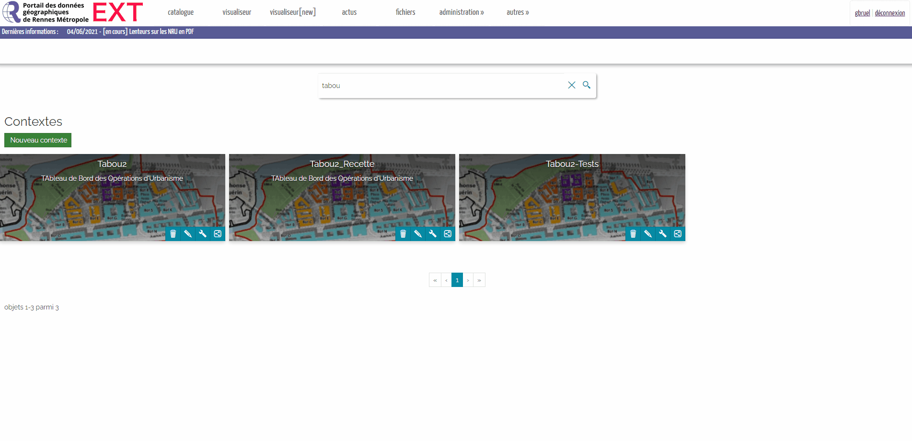
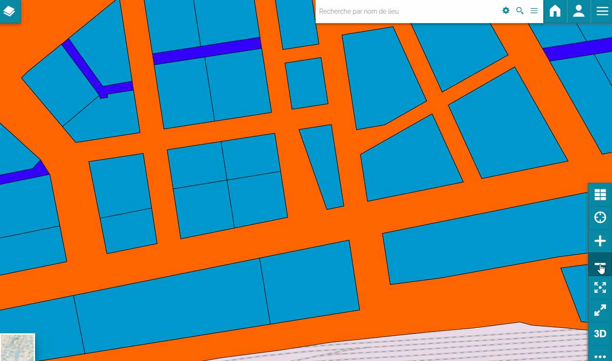

*********************************
Configuration du plugin
*********************************

Cette section vous permettra de comprendre la configuration du plugin en abordant tous les éléments essentiels de la configuration.

Accès à la configuration
========================

**Prérequis:**

* Vous devez détenir les droits suffisants pour modifier un contexte MpaStore2-geOrchestra.
* Le plugin doit être installé (voir section "généralité technique")

La configuration du plugin Tabou2 est accessible comme pour tous les autres plugins.

1. Vous devez passer le contexte en mode édition
2. Naviguez jusqu'à la section des plugins et voir les **plugins activés**
3. Recherchez le plugin "Tabou2"
4. Ouvrir la configuration du module Tabou2 en cliquant sur **Modifier la configuration du plugin** :

            Ouvrir la configuration Tabou2.

Paramètres disponibles
========================

La configuration d'un plugin MapStore est disponible en JSON. Le formalisme JSON doit être respecté.
Un exemple complet de la configuration est fourni dans la partie suivante.

Voici la liste des paramètres et les explications correspondantes.

.. csv-table:: Paramètres Tabou2
        :header: "Paramètre", "Exemple", "Description"

        "help", "{"url": "test.fr", "contact": "email@test.fr", "ddc": "url.pdf#page=2", "agapeo:"url.pdf"}", "Objet pour configurer les ressources d'aide"
        "help.url", ""url":test.fr/fichier.pdf"", "url de la documentation de l'aide"
        "help.contact", "contact: adresse@email.fr", "Email de contact"
        "help.ddc", ""ddc": "https://doc.pdf"","url de la documentation sur les données Droit de Cité"
        "help.agapeo", ""agapeo": "https://doc.pdf#page=15"", "url de la documentation sur les données du service habitat"
        "limite","150","Limite du nombre de résultats pour la recherche. Permet d'afficher un message afin d'inviter l'utilisateur à restreindre sa recherche"
        "geoserverURL","/geoserver","URL du geoserver contenant les données cartographiques du contexte Tabou2"
        "showIdentify","false", "Permet de garder le volet natif d'identification au clic sur la carte ou de le masquer"
        "layersOrder","["Opérations", "Secteurs", "Programmes"]","Ordre à afficher dans la liste des couches de l'onglet Identifier"
        "layersCfg","","Groupe de paramètres généraux des couches opération, programme et secteur"
        "layerPA","","Groupe de paramètres de la couche programme"
        "layerOA","", "Groupe de paramètres de la couche opération"
        "layerSA","","Groupe de paramètres de la couche secteur"
        "nom","app:tabou_v_oa_programme","nom de la couche programme le geoserver tel que **workspace:title**"
        "geomField","shape","Nom du champ contenant la géométrie"
        "idField","objectid","nom du champ contenant l'id de la couche"
        "idType","number", "Type du champ de l'identifiant"
        "searchCfg","", "Groupe de paramètres pour l'outil de recherche par filtes Tabou2 (onglet rechercher)"
        "communes","", "Groupe de paramètres du filtre de recherche par commune"
        "quartiers","",Groupe de paramètres du filtre de recherche par quartiers"
        "iris","","Groupe de paramètres du filtre de recherche par iris"
        "etapesoa","","Groupe de paramètres du filtre de recherche selon une étape de la couche OA"
        "etapespa","","Groupe de paramètres du filtre de recherche selon une étape de la couche PA"
        "secteurs-sam","","Groupe de paramètres du filtre de recherche par secteur type SAM"
        "secteurs-speu","","Groupe de paramètres du filtre de recherche par secteur type SPEU"
        "secteurs-sds","", "Groupe de paramètres du filtre de recherche par secteur type SDS"
        "secteurs-foncier","", "Groupe de paramètres du filtre de recherche par secteur foncier"
        "natures","","Groupe de paramètres du filtre de recherche par nature"
        "types-financements","","Groupe de paramètres du filtre de recherche par types de financements"
        "plui","","Groupe de paramètres du filtre de recherche par zone PLUI"
        "daact","","Groupe de paramètres du filtre de recherche par date DAACT"
        "doc","","Groupe de paramètres du filtre de recherche par date DOC"
        "livraison","","Groupe de paramètres du filtre de recherche par date de livraison"
        "pbil","","Groupe de paramètres du filtre de recherche selon la couche PBIL"
        "apiCfg","","Groupe de paramètres pour l'utilisation de l'API Tabou2"
        "apiURL","/tabou2","URL de l'API Tabou2",
        "documentsByPage", "5", "Nombre de documents par page pour consulter la GED"
        "layer","Pour le filtre par IRIS ==> dem_stats:iris","Nom de la couche geoserver du type workspace:title"
        "geom","Pour le filtre par IRIS ==> shape","Nom du champ contenant la géométrie"
        "placeholder","","Texte à afficher quand le filtre est vide"
        "filterField","Pour croiser la couche IRIS avec la couche des opérations, on réalisera un filtre sur le champ code_iris de la couche IRIS","Nom du champ à filtrer au sein de la couche ciblée par l'intersection spatiale"
        "cqlCondition","Utiliser pour un mapping entre les valeur de la liste (e.g un code) fourni par l'API et un champ à utiliser dans le filtre", ""
        "apiField","","Nom du champ fourni par l'API qui contient la valeur à filtrer dans le champ de la couche cible de l'intersection spatial (voir paramètre filterField)", "Voir exemple avec le filtre types de financements"
        "apiLabel","","Nom du champ de l'API qui contient la valeur à afficher dans le filtre dans le cas d'une liste ou d'une multiselection"
        "styles.default","", "Style des entités cliquées de la couche sélectionnée dans la fiche."
        "styles.selection","", "Style de l'entité en consultation dans la fiche."
        "styles.showClick", "true", "Booléen - true pour afficher l'icône du clic sur la carte quand le plugin est actif"

Explications détaillées
========================

Les filtres du plugin Tabou2 permettent de réaliser des intersection spatiale entre une couche présente ou non dans le contexte Tabou2 avec une couche PA, SA, OA.

Ces cas pratiques permettront de bien comprendre la configuration.

**1. Quartiers**

* Comportement attendu

Les valeurs des quartiers sont fournis par l'API Tabou2 afin d'être chargées et visibles dans la liste du filtre **Quartier**.

L'API fournie le numéro du quartier (utile pour la recherche dans la couche) et son nom (utile pour afficher le nom à la sélection).

Lors de la sélection d'un quartier, le plugin utilise la valeur sélectionnée (ex: Centre) pour réaliser une intersection spatiale (via geoserver cross layer) entre la couche quartier et chacune des couches programme, secteur et opération.

Le résultat permettra d'obtenir les IDs des entités de ces couches programme, secteur et opération qui intersectent le quartier sélectionné (ex: Centre).

Une fois les IDs récupérés, le plugin applique un filtre attributaire MapStore sur la couche OA, PA, SA selon les IDs récupérés et pour chaque couche.

* Configuration à appliquer

.. code-block:: json
       :linenos:

        "quartiers": {
            "layer": "ladm_terri:quartier",
            "geom": "shape",
            "placeholder": "Quartiers",
            "filterField": "nuquart",
            "apiField": "nuQuart",
            "apiLabel": "nom"
        },

* Explication de la configuration

.. csv-table:: Paramètres appliqués - filtre Quartier
        :header: "Paramètre", "Explications"

        "layer","Nous utiliserons la layer **ladm_terri:quartier** diponible dans le geoserver pour le croisement spatial"
        "geom","Le champ géométrique est nommé **shape** dans geoserver (utile pour l'intersection)"
        "placeholder","Si l'utilisateur vide la sélection, il sera affiché **Quartier** dans le filtre"
        "filterField","Le champ de la couche **ladm_terri:quartier** qui contient la valeur du quartier sélectionné, permettant donc le filtre, est nommé **nuquart**"
        "apiField","Le champ contenant la valeur à rechercher dans la couche est appelé nuQuart (différent du nom du champ dans la couche)"
        "apiLabel","Le champ de l'API qui contient le label à afficher dans la liste du filtre est nommé **nom**"

**2.Date DOC**

* Comportement attendu

L'utilisateur peut sélectionner une date et filtrer les couches programme, secteur, opération selon la date de début et de fin sélectionnée.
La difficulté est que seule la couche programme contient cette information.

A la sélection d'une date, nous souhaitons donc donc :

a. Récupérer les entités de la couche programme qui correspondent à ces dates

b. Récupérer les couches operations et secteur qui intersectent les programmes et uniquement les programmes qui correspondent aux dates choisies

c. filtrer dans MapStore2 les couches selon les IDs récupérés par l'intersection

* Configurtion à appliquer

.. code-block:: json
       :linenos:

        "doc": {
            "layer": "app:tabou_v_oa_programme",
            "geom": "shape",
            "filterField": "doc_date",
            "type": "date",
            "placeholder": "Choisir une date"
        },

* Explication de la configuration

.. csv-table:: Paramètres appliqués - filtre doc
        :header: "Paramètre", "Explications"

        "layer","Nous utiliserons la layer **app:tabou_v_oa_programme** diponible dans le geoserver pour le croisement spatial"
        "geom","Le champ géométrique est nommé **shape** dans geoserver (utile pour l'intersection)"
        "placeholder","Si l'utilisateur vide la sélection, il sera affiché **Quartier** dans le filtre"
        "filterField","Le champ de la couche **ladm_terri:quartier** qui contient la valeur du quartier sélectionné, permettant donc le filtre, est nommé **nuquart**"
        "type": "nous précisons le type car le système à besoin d'appliquer un filtre CQL particulier dans la requête d'intersection avec geoserver",
        "apiField","Inutile car nous n'utilisons pas l'API, c'est une sélection libre"
        "apiLabel","Inutile car nous n'utilisons pas l'API, c'est une sélection libre"
        "cqlCondition","Inutile ici"

Styles de la sélection
===============

Lorsqu'un utilisateur clique sur une ou plusieurs couches, la fiche information affiche :

1. Une liste des couches (visibles) cliquées qui retournent des features au clic
2. Une liste qui permet de sélectionner la feature à afficher pour la couche sélectionnée (non visible si une seule feature cliquée)

            Styles de sélection Tabou2.

Le style des entités par défaut (style "default") et le style de l'entité affichée dans la fiche (style "selection") doit correspondre aux paramètre possible pour le style OpenLayers.
D'autres paramètres de style peuvent donc être ajoutés pour plus de personnalisation.

Enfin, en utilisant les paramètres d'opacité il est alors possible d'afficher l'entités en consultation dans la fiche et / ou les autres entités retournée par le clic pour la couche sélectionnée dans la liste.

* Exemple de paramètres :

.. code-block:: json
       :linenos:

        "styles": {
            "selection": {
            "fillColor": "red",
            "fillOpacity": 0.8,
            "opacity": 1,
            "color": "yellow",
            "weight": 2
            },
            "default": {
            "fillColor": "#6f718e",
            "fillOpacity": 0,
            "opacity": 0.8,
            "color": "yellow",
            "weight": 2,
            "dashArray": [5, 5]
            }
        }

Exemple complet
===============

Voici un exemple de configuration :

.. code-block:: json
       :linenos:

        {
            "cfg": {
                "styles": {
                "showClick": true,
                "selection": {
                    "fillColor": "red",
                    "fillOpacity": 0.5,
                    "opacity": 1,
                    "color": "red",
                    "weight": 4
                },
                "default": {
                    "fillColor": "#6f718e",
                    "fillOpacity": 0,
                    "opacity": 0.8,
                    "color": "red",
                    "weight": 2,
                    "dashArray": [
                    5,
                    5
                    ]
                }
                },
                "help": {
                "url": "https://public.sig.rennesmetropole.fr/ressources/app/georchestra/Portail%20web%20guide%20rapide%20de%20prise%20en%20main.pdf",
                "contact": "d.cottencin@rennesmetropole.fr",
                "agapeo": "https://public.sig.rennesmetropole.fr/ressources/app/georchestra/Portail%20web%20guide%20rapide%20de%20prise%20en%20main.pdf",
                "ddc": "https://public.sig.rennesmetropole.fr/ressources/app/georchestra/Portail%20web%20guide%20rapide%20de%20prise%20en%20main.pdf"
                },
                "geoserverURL": "/geoserver",
                "showIdentify": false,
                "layersOrder": [
                "Opérations",
                "Secteurs",
                "Programmes"
                ],
                "layersCfg": {
                "layerPA": {
                    "nom": "tabou_test_v_oa_programme",
                    "geomField": "shape",
                    "idField": "objectid",
                    "idType": "number"
                },
                "layerOA": {
                    "nom": "tabou_test_v_oa_operation",
                    "geomField": "shape",
                    "idField": "objectid",
                    "idType": "number"
                },
                "layerSA": {
                    "nom": "tabou_test_v_oa_secteur",
                    "geomField": "shape",
                    "idField": "objectid",
                    "idType": "number"
                }
                },
                "searchCfg": {
                "limit": 1500,
                "communes": {
                    "layer": "ladm_terri:commune_emprise",
                    "geom": "shape",
                    "placeholder": "Communes",
                    "filterField": "code_insee",
                    "apiField": "codeInsee",
                    "apiLabel": "nom"
                },
                "quartiers": {
                    "layer": "ladm_terri:quartier",
                    "geom": "shape",
                    "placeholder": "Quartiers",
                    "filterField": "nuquart",
                    "apiField": "nuQuart",
                    "apiLabel": "nom"
                },
                "iris": {
                    "layer": "dem_stats:iris",
                    "geom": "shape",
                    "placeholder": "Iris",
                    "filterField": "code_iris",
                    "apiField": "codeIris",
                    "apiLabel": "nmiris"
                },
                "etapesoa": {
                    "layer": "tabou_test_v_oa_operation",
                    "geom": "shape",
                    "filterField": "etape",
                    "placeholder": "Etapes OA",
                    "apiField": "libelle",
                    "apiLabel": "libelle"
                },
                "etapespa": {
                    "layer": "tabou_test_v_oa_programme",
                    "geom": "shape",
                    "filterField": "etape",
                    "apiLabel": "libelle",
                    "apiField": "libelle",
                    "type": "string",
                    "placeholder": "Etapes PA"
                },
                "secteurs-sam": {
                    "layer": "urba_zona:v_chargedoperation_secteur",
                    "geom": "geom",
                    "filterField": "nom_secteur",
                    "apiLabel": "nomSecteur",
                    "apiField": "nomSecteur",
                    "placeholder": "Sec. SAM"
                },
                "secteurs-speu": {
                    "layer": "urba_zona:v_referent_urbaniste_secteur",
                    "geom": "geom",
                    "filterField": "nom_secteur",
                    "apiLabel": "nomSecteur",
                    "apiField": "nomSecteur",
                    "placeholder": "Sec. SPEU"
                },
                "secteurs-sds": {
                    "layer": "urba_zona:v_instructeur_secteur",
                    "geom": "geom",
                    "filterField": "secteur",
                    "apiField": "secteur",
                    "apiLabel": "secteur",
                    "placeholder": "Sec. SDS"
                },
                "secteurs-foncier": {
                    "layer": "urba_zona:v_negociateurfoncier_secteur",
                    "geom": "geom",
                    "filterField": "negociateur",
                    "apiField": "negociateur",
                    "apiLabel": "negociateur",
                    "placeholder": "Sec. Foncier"
                },
                "natures": {
                    "layer": "tabou_test_v_oa_operation",
                    "geom": "shape",
                    "service": "operations?nature",
                    "attribute": "layerOA",
                    "spatial": [
                    "layerPA",
                    "layerSA"
                    ],
                    "filterField": "nature",
                    "apiField": "libelle",
                    "apiLabel": "libelle",
                    "placeholder": "Natures"
                },
                "amenageurOA": {},
                "promoteurOA": {},
                "types-financements": {
                    "cqlCcondition": {
                    "ACC_AIDEE": "logements_access_aide > 0",
                    "ACC_LIBRE": "logements_access_libre > 0",
                    "ACC_MAITRISEE": "logements_access_maitrise > 0",
                    "LOC_AIDE": "logements_locatif_aide_prevu > 0",
                    "LOC_REGULE_HLM": "logements_locatif_regule_hlm_prevu > 0",
                    "LOC_REGULE_PRIVE": "logements_locatif_regule_hlm_prevu > 0"
                    },
                    "layer": "tabou_test_v_oa_programme",
                    "geom": "shape",
                    "filterField": "code",
                    "apiField": "code",
                    "apiLabel": "libelle",
                    "placeholder": "Type de financement"
                },
                "plui": {
                    "layer": "urba_docs_plui:plui_plan_zonage_simplifie",
                    "geom": "shape",
                    "filterField": "etiquette",
                    "apiField": "libelle",
                    "apiLabel": "libelle",
                    "placeholder": "Zonage PLUI"
                },
                "daact": {
                    "layer": "tabou_test_v_oa_programme",
                    "geom": "shape",
                    "filterField": "daact_date",
                    "type": "date",
                    "placeholder": "Choisir une date"
                },
                "doc": {
                    "layer": "tabou_test_v_oa_programme",
                    "geom": "shape",
                    "filterField": "doc_date",
                    "type": "date",
                    "placeholder": "Choisir une date"
                },
                "livraison": {
                    "layer": "tabou_v_oa_programme",
                    "geom": "shape",
                    "filterField": "livraison_date",
                    "type": "date",
                    "placeholder": "Choisir une date"
                },
                "pbil": {
                    "layer": "app:tabou_v_pbil",
                    "geom": "shape"
                }
                },
                "apiCfg": {
                "apiURL": "/tabou2",
                "documentsByPage": 5
                }
            },
            "override": {}
        }
