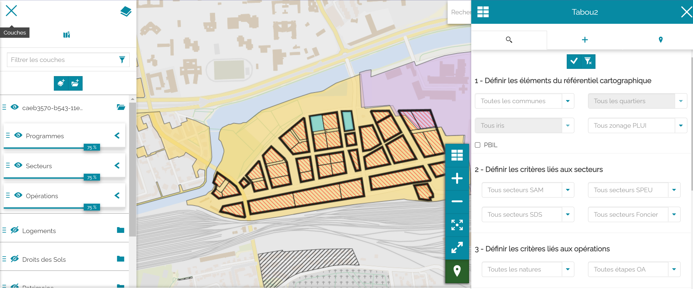

.. Tabou2 documentation master file, created by
   sphinx-quickstart on Tue Jun  8 10:49:14 2021.
   You can adapt this file completely to your liking, but it should at least
   contain the root `toctree` directive.

Documentation Tabou2
==========================

Cette documentation Tabou2 aborde la configuration du module MapStore2, son installation et la description des ressources techniques du module.

.. toctree::
   :maxdepth: 2
   :caption: Documentation administrateur

   _pages/contrib
   _pages/tech
   _pages/config
   _pages/doc